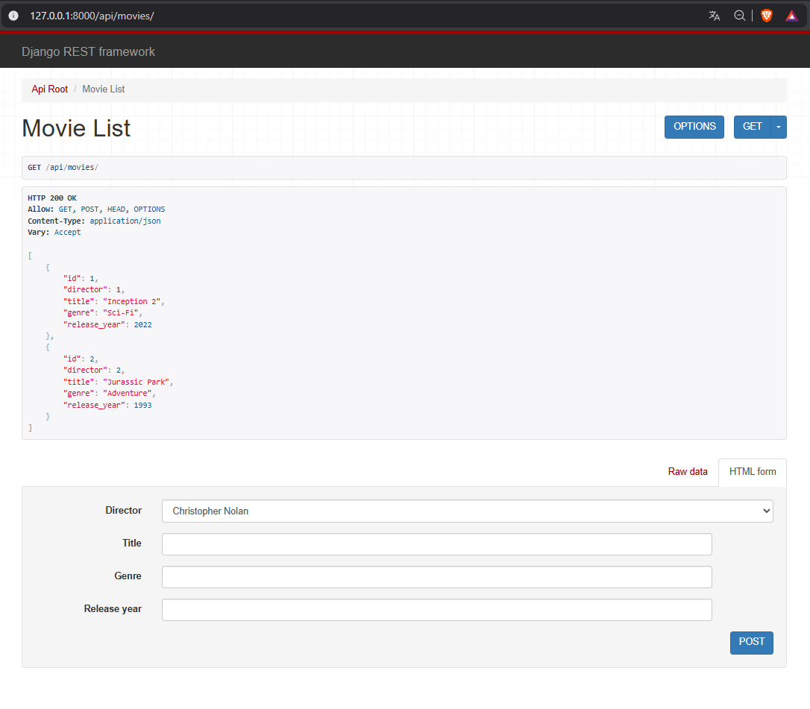
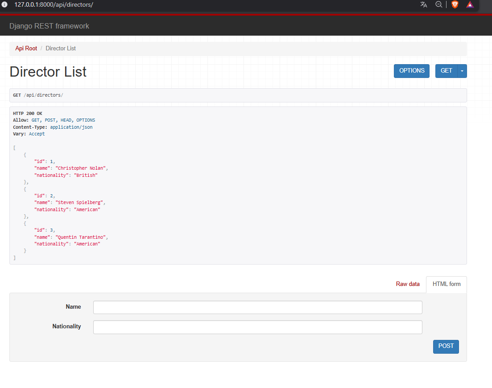

# Cinemadb API

API REST simple para gestionar películas y directores.

Descripción
- Permite listar, crear, actualizar y eliminar películas y directores.
- El modelo Movie tiene una relación ForeignKey a Director.

Serializers
- DirectorSerializer: ModelSerializer que expone todos los campos de Director.
- MovieSerializer: ModelSerializer que expone todos los campos de Movie y representa `director` como PrimaryKeyRelatedField.

Rutas principales (por defecto)
- http://127.0.0.1:8000/api/movies/
- http://127.0.0.1:8000/api/directors/

Instalación y ejecución (Windows)
1. Crear y activar entorno virtual:
   ```powershell
   python -m venv .venv
   .\.venv\Scripts\Activate.ps1
   ```
2. Instalar dependencias:
   ```powershell
   pip install -r requirements.txt
   ```
   Si no existe requirements.txt:
   ```powershell
   pip install django djangorestframework
   ```
3. Migrar y ejecutar servidor:
   ```powershell
   python manage.py migrate
   python manage.py runserver
   ```
4. Abrir las rutas indicadas en el navegador.

Archivos importantes
- Modelos: cinemadb_api/movies/models.py
- Serializers: cinemadb_api/movies/serializers.py
- Vistas: cinemadb_api/movies/views.py
- Rutas: cinemadb_api/cinemadb_api/urls.py

Evidencias
- Listado de películas:

- Listado de directores:

